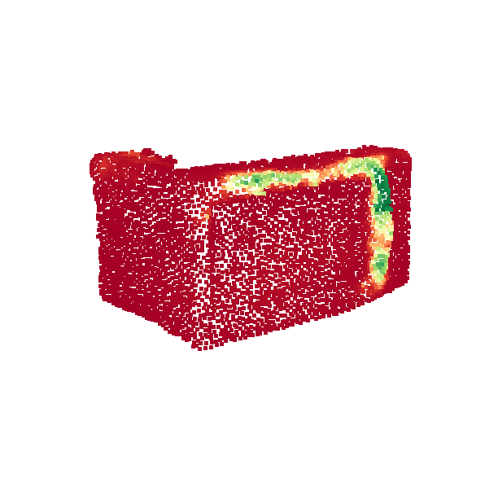
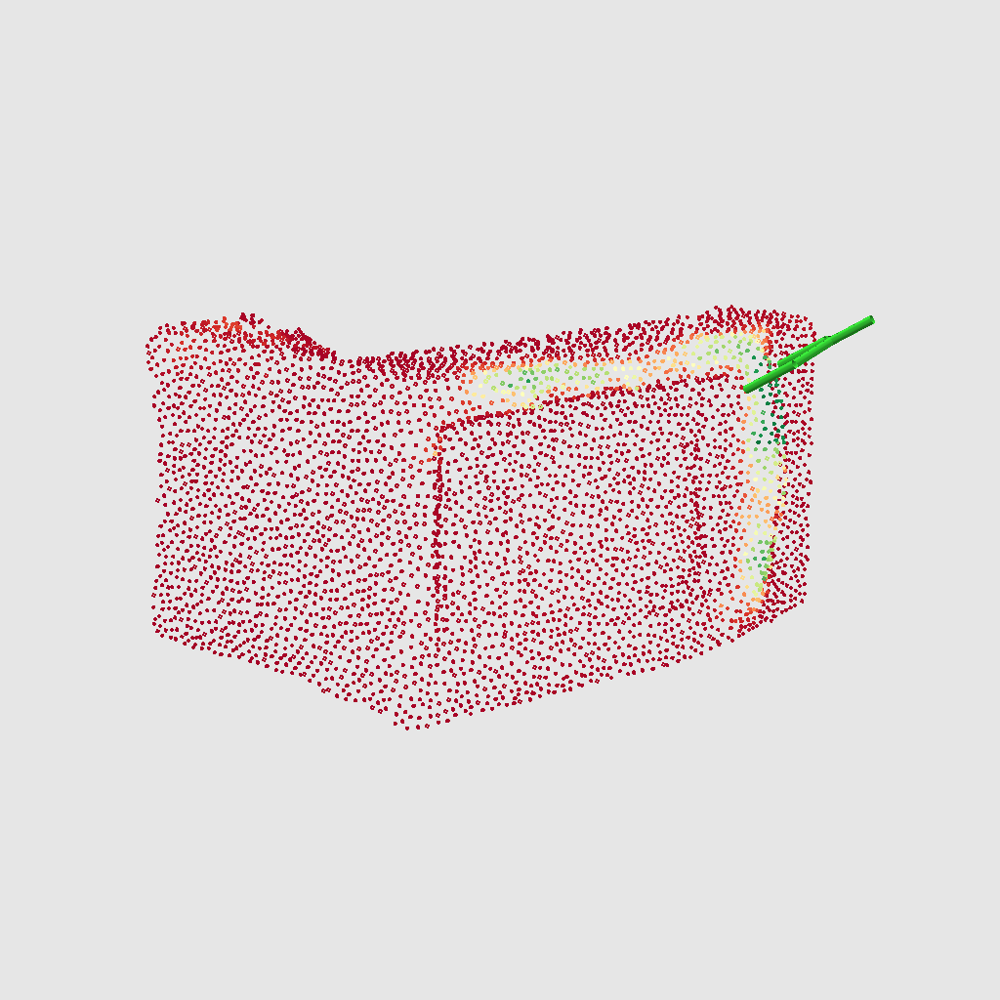

# AO-Grasp: Articulated Object Grasp Generation

[AO-Grasp project page](https://stanford-iprl-lab.github.io/ao-grasp)

Carlota Parés Morlans<sup>1*</sup>, Claire Chen<sup>1*</sup>, Yijia Weng<sup>1</sup>, Michelle Yi<sup>1</sup>, Yuying Huang<sup>1</sup>, Nick Heppert<sup>2</sup>, Linqi Zhou<sup>1</sup>, Leonidas Guibas<sup>1</sup>, Jeannette Bohg<sup>1</sup>

<sup>*</sup>Equal Contribution, <sup>1</sup>Stanford University, USA, <sup>2</sup>University of Freiburg, Germany

This repository contains:
* Code for running AO-Grasp to get actionable grasps for interacting with articulated objects from partial point clouds. See [installation](https://github.com/stanford-iprl-lab/ao-grasp?tab=readme-ov-file#installation) and [usage](https://github.com/stanford-iprl-lab/ao-grasp?tab=readme-ov-file#running-ao-grasp) guides in this readme.
* Information on how to download the AO-Grasp dataset of actionable grasps on synthetic articulated objects from the [PartNet-Mobility dataset](https://sapien.ucsd.edu/browse). See [this readme](https://github.com/stanford-iprl-lab/ao-grasp/tree/main/aograsp_dataset_utils#ao-grasp-dataset) for more information.

## Installation

AO-Grasp requires two conda environments, one for running inference to predict heatmaps, and one for running Contact-GraspNet. Follow the instructions below to set up both environments.

This code has been tested with Ubuntu 20.04 and CUDA 11.0, on a Quadro P5000 GPU. We note that we were unable to run the code, particularly the Contact-GraspNet inference, on a Geforce RTX 4090 GPU, due to a tensorflow version incompatibility.

**Step 1: Clone this repository**
First, clone this resposity and its submodule `contact_graspnet`:
```
git clone --recurse-submodules git@github.com:stanford-iprl-lab/ao-grasp.git
```

**Step 2: Setting up the `ao-grasp` conda environment**

1. From within the `ao-grasp/` directory, create a conda env named `ao-grasp` with the provided environment yaml file:

```
conda env create --name ao-grasp --file aograsp-environment.yml
```

2. Activate the new conda env you just created:
```
conda activate ao-grasp
```

3. Install PyTorch:
```
pip install torch==1.11.0+cu113 torchvision==0.12.0+cu113 torchaudio==0.11.0 --extra-index-url https://download.pytorch.org/whl/cu113
```

4. Install the `aograsp` package as an editable package
```
pip install -e .
```

5. Install PointNet++. In the `ao-grasp` conda env, install PointNet2_PyTorch from the directory contained within this repo by running the following commands:
```
cd aograsp/models/Pointnet2_PyTorch/
pip install -r requirements.txt
pip install -e .
```

6. Test the installation by predicting the per-point grasp likelihood scores on a provided test point cloud:

```
cd ../../../ # Navigate back to top-level directory
python run_pointscore_inference.py --pcd_path '/juno/u/clairech/ao-grasp/test_data/real/microwave_closed.ply'
```

This will save the predicted scores in `output/point_score/microwave_closed.npz` and a visualization of the scores in `output/point_score_img/microwave_closed.png`.



**Step 3: Setting up the `cgn` conda environment**

1. From within the `ao-grasp/contact_graspnet` directory, create a conda env named `cgn` with the provided environment yaml file.
```
cd contact_graspnet
conda env create --name cgn --file aograsp_cgn_environment.yml
```

2. Download CGN checkpoints

Download trained models from [here](https://drive.google.com/drive/folders/1tBHKf60K8DLM5arm-Chyf7jxkzOr5zGl?usp=sharing) and copy them into the `checkpoints/` folder.

3. Activate the `cgn` conda environment and test the installation from the `ao-grasp` directory
```
conda activate cgn
cd ..
python contact_graspnet/contact_graspnet/run_cgn_on_heatmap_file.py '/juno/u/clairech/ao-grasp/output/point_score/microwave_closed.npz' --viz_top_k 1
```

This will save an image of the top 1 grasp proposals in `output/grasp_proposals_img/microwave_closed.png`



## Running AO-Grasp

### Step 1: Running AO-Grasp on our test data

Running AO-Grasp inference to get grasps from point clouds requires running two scripts, each in their own conda environment. For your convenience, we have provided a bash script takes a path to a partial point cloud (saved as an Open3d point cloud) and generates proposals by calling the two scripts in their respectived conda environments. **Note: If you have named either your AO-Grasp or CGN conda envs with custom names, instead of the ones we use in our installation instructions, you will need to change the conda environment names in the bash script. See the TODOs in the bash script.**

To run this bash script on a provided test point cloud (you may need to change the permissions on the script to make it executable):
```
./get_proposals_from_pcd.sh test_data/real/microwave_open.ply
```
This will save the grasp proposals in `output/grasp_proposals/microwave_open.npz` and a visualization of the top 10 grasp proposals in `output/grasp_proposals_img/microwave_open.mp4`.


**Format of saved grasp proposal files**

A `grasp_proposals/proposal.npz` contains a single python dictionary with the following contents:
```
{
  "input": Input point cloud np.array of shape [4096, 3],
  "proposals": List of proposal tuples, where each tuple has the format (grasp_position, grasp_quaternion, grasp_likelihood_score),
  "heatmap": Grasp-likelihood scores for each point in "input", np.array of shape [4096,]
  "cgn_grasps": A list of grasps in the format generated by Contact-GraspNet. Only used to visaualize grasps using code from the original CGN repo.
}
```

To read a `proposal.npz` file, we recommend using the following line of code:
```
prop_dict = np.load(<path/to/proposal.npz>, allow_pickle=True)["data"].item()
```

### Step 2: Running AO-Grasp on your own data

To run AO-Grasp on your own data using our provided script, you must save point clouds in the [Open3d point cloud format](https://www.open3d.org/docs/release/python_api/open3d.io.write_point_cloud.html). For best performance, here are a few things to look out for when using your own data:

- Point clouds must have 4096 points.
- The object point cloud must be segmented out from the full scene
- Point clouds should be in and image coordinate system that is right-handed with the positive Y-axis pointing down, X-axis pointing right and Z-axis pointing away from the camera (ie. towards the object). This is the [default camera frame](https://www.stereolabs.com/docs/positional-tracking/coordinate-frames#selecting-a-coordinate-system) used by the Zed2 camera that we used to capture our real-world point clouds.


