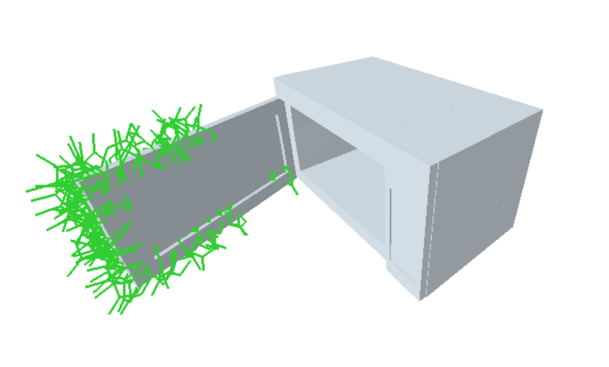
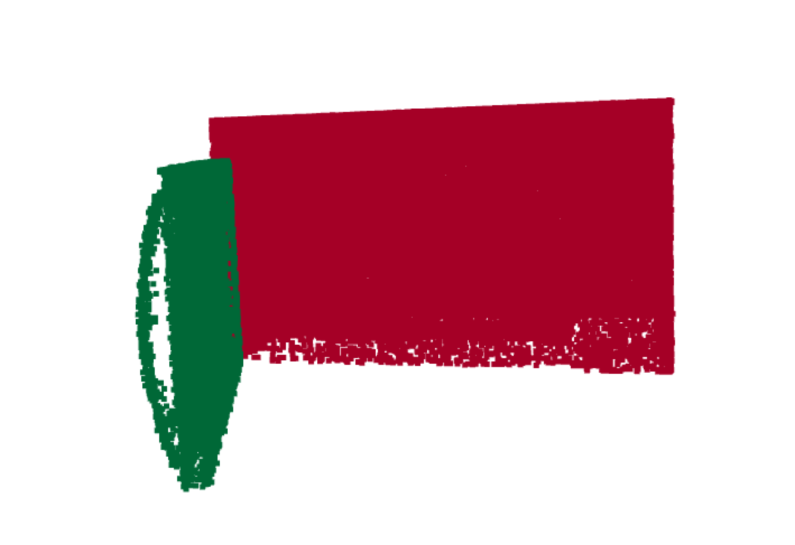
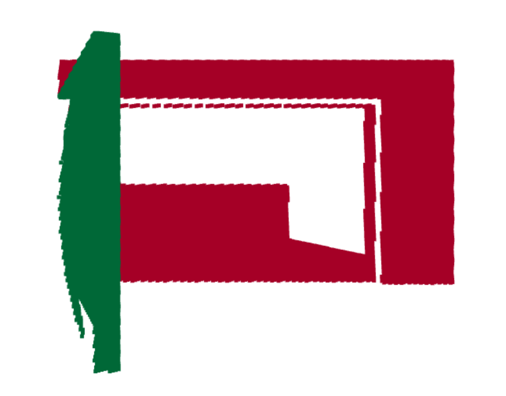
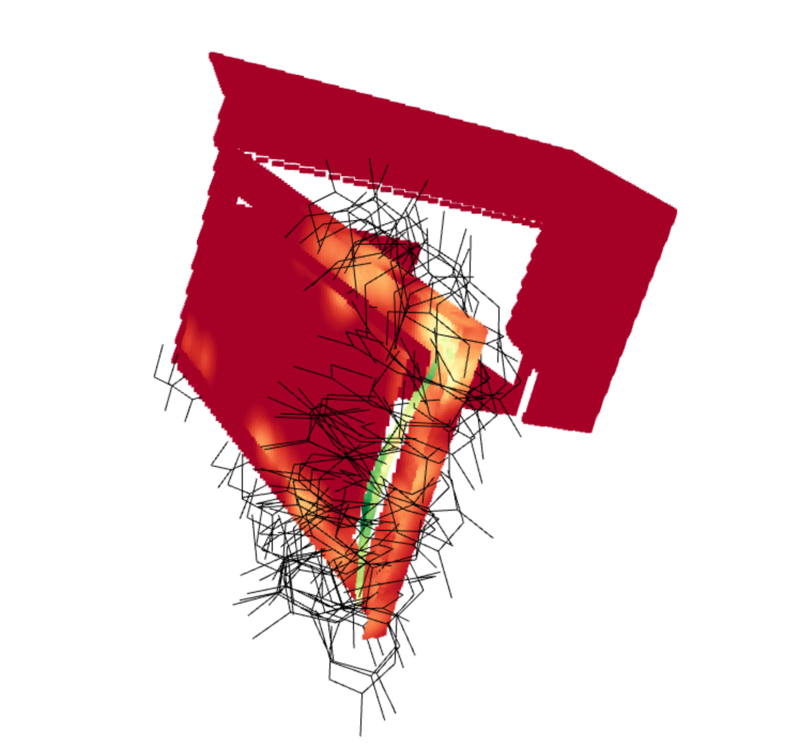

# AO-Grasp dataset

The AO-Grasp dataset contains 78,000 6 DoF parallel jaw grasps on 84 articulated object instances across 7 categires from the PartNet-Mobility dataset. It contains grasps for each object in 10 joint states: 1 closed state and 9 randomly-sampled open states. For each object state, we provide the full point clouds and partial point clouds captured from 20 randomly-sampled camera viewpoints, as well as part segmentation masks. Additionally, we include the pre-processed, PartNet-Mobility objects we used to generated data. We have pre-processed these instances by running V-HACD on their meshes to obtain convex meshes, which we find result in better collision geometries in PyBullet.

## Downloading the AO-Grasp dataset

Fill out [this form](https://forms.gle/EVZbZGMYRiyKpo6GA) to download the AO-Grasp dataset and pre-processed object meshes. Note that the form will require you to sign into a Google account. 

## Contents of the AO-Grasp dataset

### AO-Grasp dataset (`aograsp_dataset.zip`)

**Directory structure**

```
aograsp_dataset_2024
└── Box                                      # category
    └── 47645                                # instance
        └── 0                                # state, 10 per instance
            ├── init_state.npz               # information for loading object into PyBullet
            ├── point_cloud_info.npz         # full point cloud and segmentation mask
            └── raw/                         # grasp data files
                └── pos/                     # positive grasps
                    ├── 0000.npz             # positive grasp 0
                    ├── ...                  # positive grasps 1, 2, 3...
                └── neg/                     # negative grasps
                    ├── 0000.npz             # negative grasp 0
                    ├── ...                  # negative grasps 1, 2, 3...    
            └── raw_ref_img/                 # grasp data episode rollout images
                └── pos/                     # positive grasp images
                    ├── 0000_0.png           # positive grasp 0, image 0- gripper at start pose; pre collision check
                    ├── 0000_1.png           # positive grasp 0, image 1- gripper at start pose; after collision check
                    ├── 0000_2.png           # positive grasp 0, image 2- gripper after grasp
                    ├── 0000_3.png           # positive grasp 0, image 3- gripper after action
                    ├── ...                  # images for positive grasps 1, 2, 3...
                └── neg/                     # negative grasps
                    ├── ...                  # images for negative grasps 1, 2, 3...             
            └── render/                      # partial point clouds, 20 per state
                ├── all_renders.png          # RGB images of all 20 camera viewpoints
                └── 0000/                    # camera viewpoint 0
                    ├── info.npz             # camera pose, IDs of ground truth grasps in partial point cloud  
                    ├── point_cloud_seg.npz  # partial point cloud from viewpoint 0, segmentation mask, ground truth grasp-likelihood labels 
                    ├── rgb.png              # RGB image of object from viewpoint 0
                    ├── seg.png              # segmentation mask visualization from viewpoint 0
                    ├── depth.png            # depth image from viewpoint 0
                └── ..../                    # camera viewpoints 1, 2,... 19

```

**Contents of `.npz` files**

Below, we detail the contents of each of the `.npz` you'll find in the AO-Grasp dataset (see directory structure above). To read these `.npz` files, we recommend using the following:

```
data_dict = np.load(<path/to/npz_file.npz>, allow_pickle=True)["data"].item()
```

* Object state: `<state_path>/init_state.npz`
  ```
  {
    "object": {
      "trans": object base position
      "quat": object base quaternion (xyzw)
      "ins_id": ID of instance
      "scaling": object scale
      "qpos": object joint configuration
    }
  }
  ```
  See `aograsp_dataset_utils/viz_grasps_pybullet.py` for an example of how we use this file to load objects into PyBullet.
  
* Full point cloud: `<state_path>/point_cloud_info.npz`
  ```
  {
    "pts": full point cloud [100000,3], in world frame
    "seg_mask_labels": segmentation mask labels [100000,],
    "actionable_part_labels":  list of actionable part segmentation mask labels,
  }
  ```
* Grasp: `<state_path>/raw/<grasp_label>/0000.npz`
  ```
  {
    "pos_wf": end-effector xyz position, in world frame [3,], 
    "quat_wf": end-effector orientation as xyzw quaternion, in world frame [4,],
    "after_grasp_quat_wf": end-effector orientation, after gripper has closed, as xyzw quaternion [4,],
  }
  ```
* Partial point cloud info: `<state_path>/render/<viewpoint_id>/info.npz`
  ```
  {
    "camera_config": {
      "trans": camera position in world frame
      "quat": camera orientation (xyzw quaternion) in world frame
    },
    "neg_grasp_ids": array of ids of negative grasps in dataset,
    "pos_grasp_ids": array of ids of positive grasps in dataset,
  }
  ```
  See `aograsp_dataset_utils/viz_pointcloud.py` for an example of how we use this file to visualize all grasps contained in a partial point cloud.

* Partial point cloud: `<state_path>/render/<viewpoint_id>/point_cloud_seg.npz`
  ```
  {
    "pts": [N, 3] points in partial point cloud, in world frame,
    "seg_mask_labels": [N,] segmentation mask labels,
    "grasp_likelihood_labels": [N,] pseudo-ground truth grasp likelihood labels,
    "actionable_part_labels": list of actionable part segmentation mask labels,
  }
  ```


### Pre-processed object meshes (`aograsp_instances.zip`)

We have pre-processed the PartNet-Mobility instances used by AO-Grasp by running V-HACD on their meshes to obtain convex meshes, which we find result in better collision geometries in PyBullet. Each instance directory contains the object URDF (`mobility.urdf`) as well as the pre-processed meshes in `textured_objs/`. 

Note: The instances we include here are only a subset of the PartNet-Mobility dataset. To download the full PartNet-Mobility dataset, visit their [webpage](https://sapien.ucsd.edu/downloads).

## Visualizing the AO-Grasp dataset

After you have downloaded the dataset and object meshes, we provide two scripts to visualize the data. You will need to be in the `ao-grasp` conda environment you created in [Step 1 of our installation instructions](https://github.com/stanford-iprl-lab/ao-grasp?tab=readme-ov-file#installation):

```
conda activate ao-grasp
```

**Visualizing grasps in PyBullet on object instance**

To run this script, make sure the `aograsp_instances` directory is contained in the top-level `ao-grasp` directory.

To visualize positive grasps on an object instance for a given state (ie. Microwave 7221 state 1), use the following command (passing in the desired state path in the `aograsp_dataset_2024` directory:

```
python aograsp_dataset_utils/viz_grasps_pybullet.py --state_path <path/to>/aograsp_dataset_2024/Microwave/7221/1/
```


**Visualizing point clouds**

We also provide a script to visualize the various point clouds in the AO-Grasp dataset. 

**Full point clouds**

To visualize a full point cloud (in `<state_path>/point_cloud_info.npz` files) with the segmentation mask (actionable parts in green):
```
python aograsp_dataset_utils/viz_pointcloud.py <path/to>/aograsp_dataset_2024/Microwave/7221/1/point_cloud_info.npz --seg_mask
```


**Partial point clouds**

To visualize a partial point cloud (in `<state_path>/render/<viewpoint_id>/point_cloud_seg.npz` files), by default with ground-truth dense grasp-likelihood labels:
```
python aograsp_dataset_utils/viz_pointcloud.py <path/to>/aograsp_dataset_2024/Microwave/7221/1/render/0000/point_cloud_seg.npz
```


Optionally, for partial point clouds, you may also view the partial point cloud with the segmentation mask (actionable parts in green), using `--seg_mask`:



And with the ground truth positive grasps, using `--gt_grasps`:




